# ER 关系图

```mermaid
erDiagram
    relic_category ||--o{ relic : contains
    article_category ||--o{ article : classifies
    visit_schedule ||--o{ reservation : owns

    museum {
        BIGINT id PK
        VARCHAR title
        TINYINT status
    }
    relic_category {
        BIGINT id PK
        VARCHAR name
        INT sort
    }
    relic {
        BIGINT id PK
        BIGINT category_id FK
        VARCHAR name
        BIGINT views
        TINYINT status
    }
    exhibition {
        BIGINT id PK
        VARCHAR title
        DATE start_date
        DATE end_date
        TINYINT status
    }
    article_category {
        BIGINT id PK
        VARCHAR name
        INT sort
    }
    article {
        BIGINT id PK
        BIGINT category_id FK
        VARCHAR title
        DATETIME published_at
        TINYINT status
    }
    person {
        BIGINT id PK
        VARCHAR name
        TINYINT status
    }
    history_event {
        BIGINT id PK
        INT year
        DATE event_date
        VARCHAR title
        TINYINT status
    }
    courtyard {
        BIGINT id PK
        VARCHAR name
        DECIMAL position_x
        DECIMAL position_y
        TINYINT status
    }
    visit_schedule {
        BIGINT id PK
        DATE visit_date
        ENUM period
        INT capacity
        INT reserved_count
        TINYINT status
    }
    reservation {
        BIGINT id PK
        VARCHAR reservation_no
        BIGINT schedule_id FK
        VARCHAR phone
        DATE visit_date
        INT people_count
        TINYINT status
    }
    feedback {
        BIGINT id PK
        VARCHAR name
        VARCHAR phone
        TINYINT status
    }
    visit_log {
        BIGINT id PK
        VARCHAR visitor_id
        VARCHAR page_path
        DATETIME created_at
    }
    admin {
        BIGINT id PK
        VARCHAR username
        VARCHAR password_hash
        ENUM role
        TINYINT status
    }
```

## 关系说明

- `relic_category.id` → `relic.category_id`：分类删除时文物保留，分类字段置空。
- `article_category.id` → `article.category_id`：分类删除时文章保留，分类字段置空。
- `visit_schedule.id` → `reservation.schedule_id`：已有关联预约的排期不允许删除。
- 其余表在 D3 独立保存，避免将未核实的历史人物、事件、院落或内容关系写死。未来如需“人物—文物”“院落—展览”等关系，再以专用中间表扩展。
